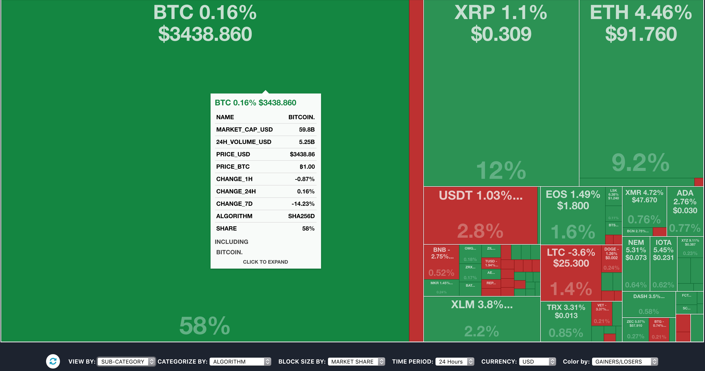
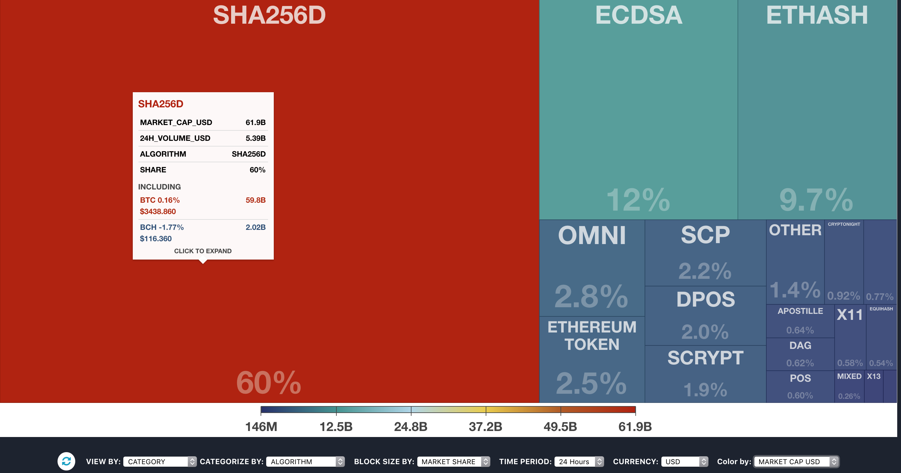
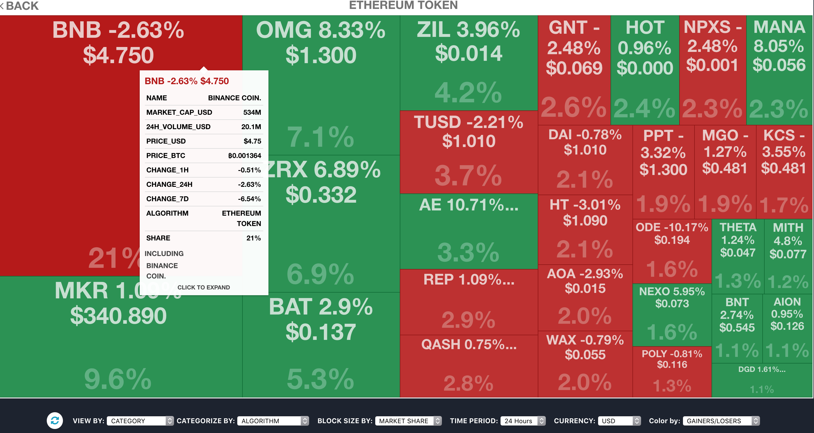

# Coinvista
Visualization of the live crypto-currency market data using a interactive treemap.

<a href="https://coinvista.github.io/coinvista/coinvista.html" target="_blank" >CoinVista</a> 

Data source: <a href="https://api.coinlore.com/api/tickers/" target="_blank" >CoinLore</a>

** site is still being developed, so additonal information is only being showen for bitcoin. I'm currently adding information for about 25 coins a day at min and should have them all in by 12/10/18 **

Motivation
-----------
1. Create a better version of <a href="https://coin360.io" target="_blank" >coin360.io</a>, by improving interactions, adding more information per coin,  and creating more visualization options, while simplfying the code as much as possilbe. I choose coin360.io, as it is the best visualization of the live crypto currency market that I've seen.

How to use
-----------
* If you are viewing by category which is default, click on a block so see the coins on a category, and click on a coin, and scroll down to see more information about it. 
* Hovering over a block will give you live market data in a tooltip. Hovering over a coin gives you information about that coin, while hover over a category block will give you information about all the coins in that cateogry, with only numerical values like market cap, being a sum off the market caps for all coins in that category.

How to run
-----------
1. In the terminal cd to the directory you cloned this program
2. Run the command "python3 -m http.server", and click ok on the pop up from the chrome browser
3. Go to http://localhost:8000/
4. Click on coinvista.html

Pictures
--------

Improvements
------------
1. By viewing by category, you can click on a category and view all the coins in it using the entire screen. I think this better than having to zoom in smaller circles when a category has a bunch of small rectangles. You also have the option to view by subcategory which is the view coin360 only offers.
2. You can see the size of each block as a percentage
3. Tooltips have more live market information about a coin, and clicking on a coin and scrolling down gives you more backround information about that coin.
4. In additon to having all the same options to configure the visualzation, Coinvista has addtional options like viewing winners and losers as category, and it also can color code the treemap by gainers/losers, by market cap, by 24 hour volume, available supply, and max supply.
5. D3plus makes coding this visualiztion much simpler and much better.

Todo
--------
1. Add backround information for the remaining 99 coins/tokens.
2. Add ether and eos as currency options
3. Add the option to view just token, coins, or mineable coins/tokens
4. add treemap for currency exchanges
5. make clicking and tooltip mobile friendly
6. Improve the UI, making it a more prettier and slick one page scroller.
7. Upgrade the code to use d3plus ver 2.
7. use an api with more information, which requires using a server side language, which github pages does not host, so recode and host somewhere else. 

