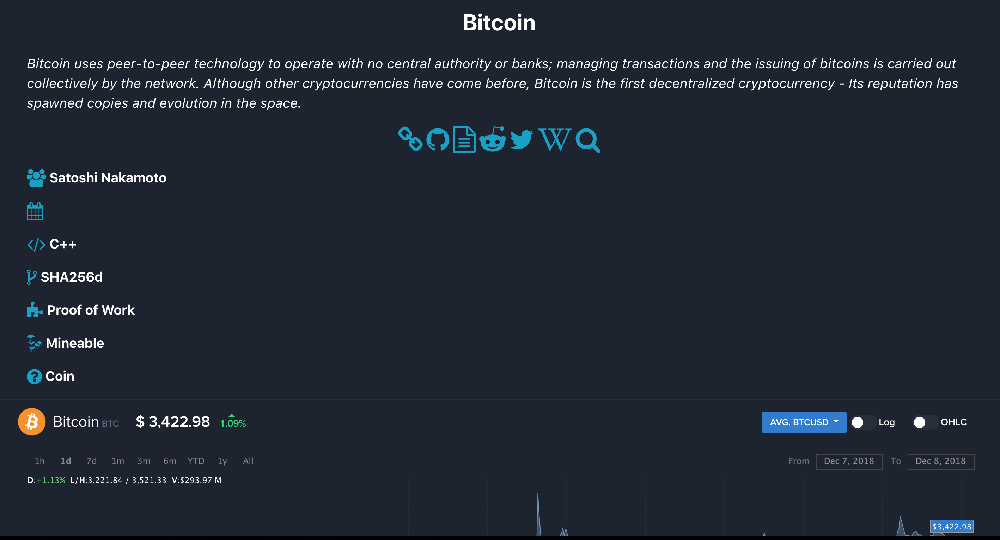

# Coinvista
Visualization of the live crypto-currency market data using a interactive treemap.

Site:
-------
<a href="https://coinvista.github.io/coinvista" target="_blank" >CoinVista</a> 

Data source
------
<a href="https://api.coinlore.com/api/tickers/" target="_blank" >CoinLore</a>

Notice
-------
** site is still being developed, so additonal information is being added for each coin. **

Motivation
-----------
1. Create a better version of <a href="https://coin360.io" target="_blank" >coin360.io</a>, by improving interactions, adding more information per coin,  and creating more visualization options, while simplfying the code as much as possilbe. I choose coin360.io, as it is the best visualization of the live crypto currency market that I've seen.

How to use
-----------
* If you are viewing by category which is default, click on a block so see the coins on a category, and click on a coin, and scroll down to see more information about it. 
* Hovering over a block will give you live market data in a tooltip. Hovering over a coin gives you information about that coin, while hover over a category block will give you information about all the coins in that cateogry, with only numerical values like market cap, being a sum off the market caps for all coins in that category.

How to run
-----------
1. In the terminal cd to the directory you cloned this program
2. Run the command "python3 -m http.server", and click ok on the pop up from the chrome browser
3. Go to http://localhost:8000/
4. Click on coinvista.html

Pictures
--------

Todo
--------
1. Add backround information for the remaining 99 coins/tokens.
2. Add ether and eos as currency options
3. Add the option to view just token, coins, or mineable coins/tokens
4. add treemap for currency exchanges
5. make clicking and tooltip mobile friendly
6. Improve the UI, making it a more prettier and slick one page scroller.
7. Upgrade the code to use d3plus ver 2.
7. use an api with more information, which requires using a server side language, which github pages does not host, so recode and host somewhere else. 

